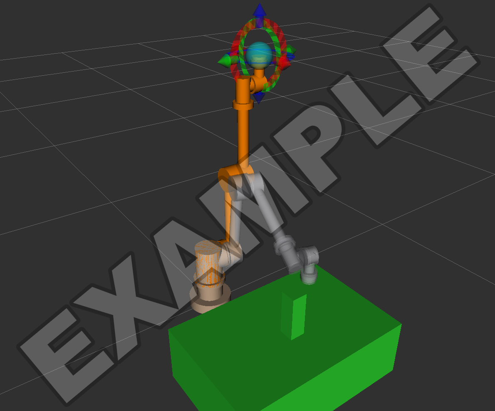

# Challenge Homework Help

This page provides example screenshots, setup notes, and troubleshooting guidance
for Robotics Challenge Homeworks 1 and 2.

Use the Kinova course image
(`ghcr.io/mems-intro-to-robotics/mems-robotics-toolkit:kinova-jazzy-latest`), the
same image as Labs 5 and 6.

## Getting the starter repository

Accept each homework with Classroom 50 on the VM, as in the labs, and clone the
repository it prints into `~/workspaces`:

```bash
gh student accept MEMS-Intro-to-Robotics intro-to-robotics-fall-2026 challenge-01
gh student accept MEMS-Intro-to-Robotics intro-to-robotics-fall-2026 challenge-02
```

The starter repositories supply these files:

| File | Homework | What it does |
|---|---|---|
| `display.launch.py` | 1 and 2 | Shows a URDF or xacro file in RViz with a slider for each joint. |
| `fix_moveit_config.py` | 2 | Corrects known errors in the package the MoveIt Setup Assistant generates. |
| `gz_sim.launch.py` | 2 | Starts Gazebo with your robot, a world, and your robot's controllers. |
| `moveit_sim.launch.py` | 2 | Starts MoveIt and RViz for the robot running in Gazebo. |
| `task_world.sdf` | 2 | A starter Gazebo world with a table and a block. |

Run the launch files by path from the repository root, as you ran
`lab06_sim.launch.py` in Lab 6: `ros2 launch gz_sim.launch.py ...`.

For Homework 2, copy your description package from the Homework 1 repository into
the Homework 2 repository's `ros2_ws/src/`, including its `meshes/` folder.

## Working environment

Start the course container as in Lab 6, with its own name:

```bash
xhost +local:docker
docker run --rm -it --name chw --net=host --gpus all -e DISPLAY=$DISPLAY -e ROS_AUTOMATIC_DISCOVERY_RANGE=LOCALHOST -v /tmp/.X11-unix:/tmp/.X11-unix:ro -v ~/workspaces:/root/workspaces ghcr.io/mems-intro-to-robotics/mems-robotics-toolkit:kinova-jazzy-latest
```

Open more terminals with `docker exec -it chw bash`. Keep your workspace at
`ros2_ws/` in your repository, build it with `colcon build --symlink-install`, and
source `install/setup.bash` in every terminal that runs your code. Run Git on the
VM.

## Homework 1: CAD, URDF, and RViz

### Generating the URDF from Fusion

Staff tested the
[Fusion 360 URDF exporter for ROS 2](https://github.com/runtimerobotics/fusion360-urdf-ros2)
on an example arm in the course image on 2026-10-09; its output worked in RViz,
the Setup Assistant, and Gazebo after the edits below. Install it as its README
describes. Exporters for other CAD programs exist, and any of them is allowed.

Set up the Fusion design before exporting:

- Make one component per link, all directly under the top level of the design.
- Name the base component `base_link`.
- Connect the links with Revolute joints, and set both rotation limits on every
  joint. The exporter stops with an error when a limit is missing.
- Assign a material to every component so the exporter calculates masses and
  inertias from those materials.

When the exporter asks whether you use Gazebo Harmonic, answer **Yes**. It writes
an `ament_python` package named after the first word of the design's name, with
`_description` added, and names each link after its Fusion component (`link1:1`
becomes `link1_1`). Copy that package into `ros2_ws/src/` and build it.

Then edit the generated `urdf/<robot>.xacro`:

- **Add a `world` link (required).** Without it the base is free to move in
  Gazebo. In the staff test, the arm tipped over when it reached out, while the
  measured joint positions still matched the commands. Add this just before the
  `base_link` link:

    ```xml
    <link name="world"/>
    <joint name="world_fixed" type="fixed">
      <parent link="world"/>
      <child link="base_link"/>
    </joint>
    ```

- **Add `tool0` (required in Homework 1).** A fixed link at the tool flange gives
  the Setup Assistant's chain and your task script a clear end point. Add it after
  your last link, with `xyz` set to the flange's position in that link's frame:

    ```xml
    <link name="tool0"/>
    <joint name="tool_fixed" type="fixed">
      <parent link="link6_1"/>
      <child link="tool0"/>
      <origin xyz="0 0 0.02" rpy="0 0 0"/>
    </joint>
    ```

- **Check the inertias.** The exporter rounds every inertia value to six decimal
  places in kg·m². A very small link can come out with zeros; enlarge or replace
  those values.
- **Joint speed.** The exporter sets every joint's velocity limit to 100 rad/s.
  MoveIt slows motions to a tenth of the limit by default; lower the limit in the
  URDF if the arm still moves too fast.

The URDF file is `<robot>.xacro`, so pass that path to `display.launch.py` and
the Setup Assistant. Its mesh paths start with `file://$(find ...)`, which
`xacro` fills in; every course tool reads the URDF through `xacro`.

### Writing the package by hand

Use an `ament_cmake` description package with this layout and install its folders:

```text
ros2_ws/src/<robot>_description/
├── CMakeLists.txt
├── package.xml
├── meshes/        one STL per link
└── urdf/
    └── <robot>.urdf.xacro
```

In `CMakeLists.txt`, after `find_package(ament_cmake REQUIRED)`:

```cmake
install(DIRECTORY urdf meshes DESTINATION share/${PROJECT_NAME})
```

Refer to meshes as `package://<robot>_description/meshes/<link>.stl`. Build the package and source
`install/setup.bash` so ROS can locate its installed resources. If RViz
reports `Could not load resource [package://...]`, check the build, the sourced
environment, and the mesh path.

### Exporting meshes from CAD

- **Units.** STL files have no units. If your CAD tool exports in millimeters, ROS
  interprets the values as meters, so the mesh appears 1000 times too large. Export in
  meters or add `scale="0.001 0.001 0.001"` to each `<mesh>` element.
- **Origins.** A mesh's pose is defined relative to its link frame. Export each
  part with an origin and orientation that match the link frame, or account for
  the difference with the URDF visual origin.
- **Mass properties.** CAD tools report each part's mass, center of mass, and
  inertia tensor once you assign a material. Use those numbers in `<inertial>`, and
  convert them to kilograms, meters, and kg·m². Make sure the inertia is about the
  center of mass, expressed in the inertial frame defined in the URDF.

### Checking and displaying the URDF

```bash
check_urdf <(xacro ros2_ws/src/<robot>_description/urdf/<robot>.urdf.xacro)
ros2 launch display.launch.py model:=ros2_ws/src/<robot>_description/urdf/<robot>.urdf.xacro
```

`check_urdf` prints the tree of links. Check that the arm's links form a chain from
`world` to `tool0`. `display.launch.py` opens RViz and a window of joint sliders;
**Randomize** moves every joint at once.


*An example arm built from cylinders and round flanges, shown by `display.launch.py`
and posed with the sliders.*

If RViz shows `Frame [world] does not exist`, check that the robot's transforms
are being published. If the root link is not named `world`, rename it or pass
`fixed_frame:=<your root link>`.

## Homework 2: MoveIt and Gazebo

### The Setup Assistant

```bash
ros2 launch moveit_setup_assistant setup_assistant.launch.py
```

- **Load the URDF with Browse.** Typing a partial path, such as `/`, can
  trigger a crash in the course version of the Setup Assistant. Pick the
  `.urdf.xacro` file from your `src/` folder in the Browse dialog.
- **Planning group.** Add a group with a KDL kinematics solver, then
  **Add Kin. Chain** from your base link to `tool0`.
- **Robot poses.** Add at least one named pose, such as `home`, for your task to
  return to.
- **ros2_control and controllers.** Keep the default interfaces (position command;
  position and velocity state). On both the **ROS 2 Controllers** and the
  **MoveIt Controllers** pages, use the Auto Add button.
- **Configuration files.** Fill in Author Information first, then generate into
  `ros2_ws/src/<robot>_moveit_config`. Warnings about end effectors or virtual joints
  can be left unresolved if your robot configuration does not need them.


### Fix the generated package

Check for these configuration problems in packages generated by the
Setup Assistant in ROS 2 Jazzy:

- `joint_limits.yaml` may have acceleration limits disabled. Planning can fail with
  `No acceleration limit was defined for joint ...`, which pymoveit2 reports as
  `Error code: 99999`.
- `moveit_controllers.yaml` may omit the controller's action namespace. MoveIt
  can then log `Returned 0 controllers in list` and fail to execute plans.
- `joint_limits.yaml` copies whole-number limits from the URDF as whole numbers,
  for example `max_velocity: 100` from the Fusion exporter's `velocity="100"`.
  MoveIt then stops at startup with `expected [double] got [integer]`, and every
  plan fails.

`fix_moveit_config.py` corrects all three. Run it after regenerating the package,
then rebuild:

```bash
python3 fix_moveit_config.py ros2_ws/src/<robot>_moveit_config
cd ros2_ws && colcon build --symlink-install && source install/setup.bash
```

Check the result with `ros2 launch <robot>_moveit_config demo.launch.py`. This runs
MoveIt against a simulated controller without Gazebo, and Plan & Execute in RViz
should move the arm.

### Gazebo and MoveIt together

Use two terminals, and start MoveIt after Gazebo reports its controllers active:

```bash
ros2 launch gz_sim.launch.py moveit_config:=<robot>_moveit_config world:=task_world.sdf
ros2 launch moveit_sim.launch.py moveit_config:=<robot>_moveit_config
```

`gz_sim.launch.py` reads the URDF and controller list from your MoveIt package,
swaps the Setup Assistant's simulated hardware for Gazebo's, spawns the robot, and
starts its controllers. `ros2 control list_controllers` should show your arm
controller and `joint_state_broadcaster` as `active`.
Stop `demo.launch.py` before you start Gazebo. It runs its own controllers for the
same joints.




*An example task: the arm touches targets on the table and goes around the red
post. MoveIt does not read Gazebo's world, so the task script adds the table and
post to the planning scene (green in RViz) before it plans.*

### Your world

Copy `task_world.sdf` and edit it. Objects with `<static>true</static>` stay fixed
under physics simulation, which suits tables and fixtures. The three `<plugin>` lines at the top are
the systems Gazebo loads by default. Gazebo uses its defaults only when a world
lists no plugins, so if you add a plugin of your own, keep those three beside it.

Gazebo world objects are not automatically added to MoveIt's planning scene.
To make MoveIt plan around them,
add matching boxes to the planning scene from your script with
`add_collision_box`, as in Lab 5 milestone 3.

### Your task script

Use `pymoveit2` as in Labs 5 and 6, with your own joint names, base link, end
effector (`tool0`), and group name. The
[pymoveit2 API guide](pymoveit2_api_guide.md) covers the calls.

- Start the script after the MoveIt terminal prints
  `Ready to take commands for planning group`. A script that requests a plan before the service is ready can report
  `Service 'plan_kinematic_path' is not yet available` and fail to plan.
- The planner is randomized, so retry a failed plan a few times before giving up,
  as `move_to_joints()` did in Lab 5.
- Check that each move reached its goal using the measured joint positions on
  `/joint_states`; the return value of `execute()` alone does not confirm arrival. In a staff run of the example task,
  `execute()` reported success while the arm was stopped 74 mm short of its goal
  in Gazebo.

### Grasping in Gazebo

Picking up objects is optional. Simple finger contacts in Gazebo can let an object
slip during motion or push it when the fingers open. Lab 6 used a separate helper
node to hold the block. If you add an actuated gripper, configure its controller.
Tasks without grasping are also acceptable.

## Troubleshooting

| Symptom | Possible cause and checks |
|---|---|
| Setup Assistant closes while you type the URDF path | Known crash; use Browse. |
| `No acceleration limit was defined for joint` | Run `fix_moveit_config.py`, rebuild. |
| `Returned 0 controllers in list`, plans never move the arm | Run `fix_moveit_config.py`, rebuild. |
| `move_group` stops at startup with `expected [double] got [integer]` | Run `fix_moveit_config.py`, rebuild. |
| The whole arm tips over in Gazebo | The URDF has no `world` link fixed to `base_link`; add one (see "Generating the URDF from Fusion"). |
| `Could not load resource [package://...]` | Build the description package and source `install/setup.bash`; check that `CMakeLists.txt` installs `meshes`. |
| Robot is huge in RViz or Gazebo | If meshes were exported in millimeters, add `scale="0.001 0.001 0.001"`. |
| Links float away from their joints | Check mesh origins and URDF visual transforms; correct the CAD export or the URDF transform. |
| Arm collapses or shakes in Gazebo | Check each moving link's mass and inertia: positive mass and a physically valid inertia tensor consistent with the part's size and mass. Off-diagonal inertia terms can be zero. |
| The arm passes through an object | Check the object's representation and pose in MoveIt's planning scene; add a missing object with `add_collision_box`. |

For container, build, and MoveIt problems that recur across labs, see
[Troubleshooting](../troubleshooting.md).
