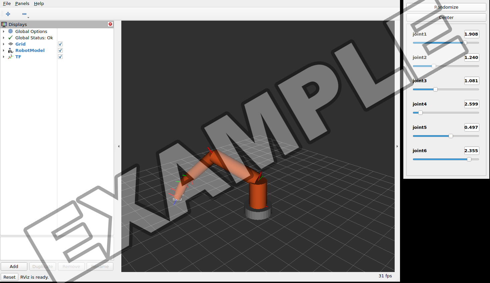
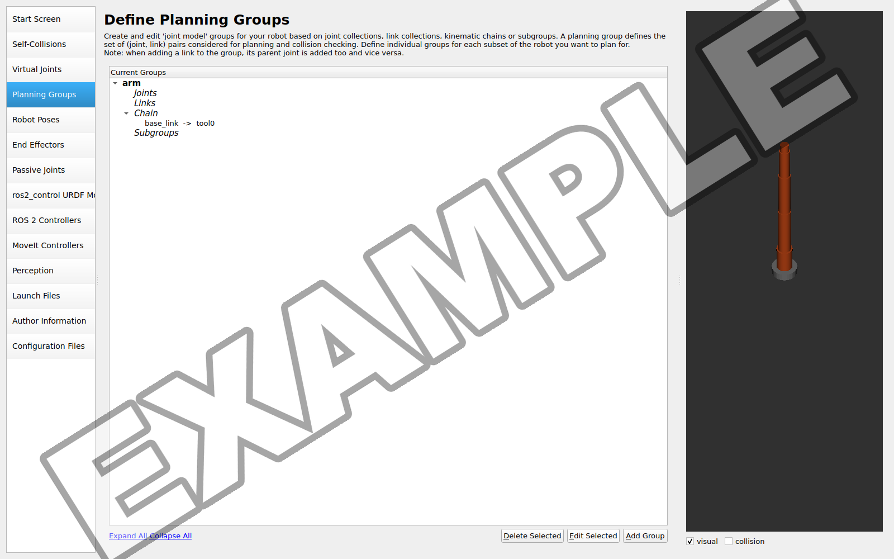
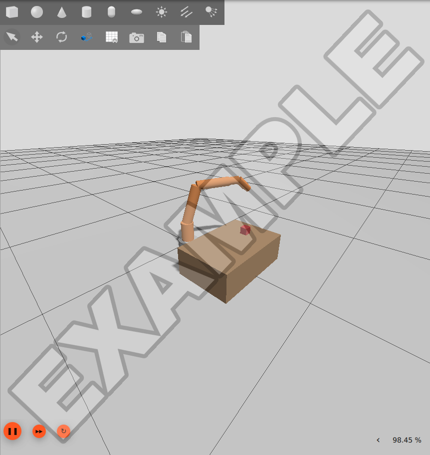

# Challenge Homework Help

This page provides example screenshots, setup notes, and troubleshooting guidance
for Robotics Challenge Homeworks 1 and 2. Consult it while working through the
assignments.

Everything here was tested in the Kinova course image
(`ghcr.io/mems-intro-to-robotics/mems-robotics-toolkit:kinova-jazzy-latest`), the
same image as Labs 5 and 6.

## Getting the starter repository

Accept each homework with Classroom 50 on the VM, as in the labs, and clone the
repository it prints into `~/workspaces`:

```bash
gh student accept MEMS-Intro-to-Robotics intro-to-robotics-fall-2026 challenge-01
gh student accept MEMS-Intro-to-Robotics intro-to-robotics-fall-2026 challenge-02
```

The starter repositories supply these files:

| File | Homework | What it does |
|---|---|---|
| `display.launch.py` | 1 and 2 | Shows a URDF or xacro file in RViz with a slider for each joint. |
| `fix_moveit_config.py` | 2 | Corrects two errors in the package the MoveIt Setup Assistant generates. |
| `gz_sim.launch.py` | 2 | Starts Gazebo with your robot, a world, and your robot's controllers. |
| `moveit_sim.launch.py` | 2 | Starts MoveIt and RViz for the robot running in Gazebo. |
| `task_world.sdf` | 2 | A starter Gazebo world with a table and a block. |

Run the launch files by path from the repository root, as you ran
`lab06_sim.launch.py` in Lab 6: `ros2 launch gz_sim.launch.py ...`.

For Homework 2, copy your description package from the Homework 1 repository into
the Homework 2 repository's `ros2_ws/src/`, including its `meshes/` folder.

## Working environment

Start the course container as in Lab 6, with its own name:

```bash
xhost +local:docker
docker run --rm -it --name chw --net=host --gpus all -e DISPLAY=$DISPLAY -e ROS_AUTOMATIC_DISCOVERY_RANGE=LOCALHOST -v /tmp/.X11-unix:/tmp/.X11-unix:ro -v ~/workspaces:/root/workspaces ghcr.io/mems-intro-to-robotics/mems-robotics-toolkit:kinova-jazzy-latest
```

Open more terminals with `docker exec -it chw bash`. Keep your workspace at
`ros2_ws/` in your repository, build it with `colcon build --symlink-install`, and
source `install/setup.bash` in every terminal that runs your code. Git runs on the
VM, not in the container.

## Homework 1: CAD, URDF, and RViz

### Package layout

A description package is an `ament_cmake` package that installs its folders:

```text
ros2_ws/src/<robot>_description/
├── CMakeLists.txt
├── package.xml
├── meshes/        one STL per link
└── urdf/
    └── <robot>.urdf.xacro
```

In `CMakeLists.txt`, after `find_package(ament_cmake REQUIRED)`:

```cmake
install(DIRECTORY urdf meshes DESTINATION share/${PROJECT_NAME})
```

Refer to meshes as `package://<robot>_description/meshes/<link>.stl`. That path only
resolves after the package is built and `install/setup.bash` is sourced. If RViz
reports `Could not load resource [package://...]`, one of those two steps is missing.

### Exporting meshes from CAD

- **Units.** STL files have no units. If your CAD tool exports in millimeters, ROS
  interprets the values as meters, so the mesh appears 1000 times too large. Export in
  meters or add `scale="0.001 0.001 0.001"` to each `<mesh>` element.
- **Origins.** A link's mesh is drawn at that link's frame, which sits at the joint
  that drives the link. In CAD, place each part so its origin is on its joint axis
  before you export it. An origin elsewhere can make the link appear offset.
- **Mass properties.** CAD tools report each part's mass, center of mass, and
  inertia tensor once you assign a material. Use those numbers in `<inertial>`, and
  convert them to kilograms, meters, and kg·m². Make sure the inertia is about the
  center of mass, expressed in the link frame.

### Checking and displaying the URDF

```bash
check_urdf <(xacro ros2_ws/src/<robot>_description/urdf/<robot>.urdf.xacro)
ros2 launch display.launch.py model:=ros2_ws/src/<robot>_description/urdf/<robot>.urdf.xacro
```

`check_urdf` prints the tree of links. Your arm should appear as one chain from
`world` to `tool0`. `display.launch.py` opens RViz and a window of joint sliders;
**Randomize** moves every joint at once.



*A test arm built from cylinders with an STL base, shown by `display.launch.py`.*

If RViz shows `Frame [world] does not exist`, your root link is not named `world`.
Rename it, or pass `fixed_frame:=<your root link>`.

## Homework 2: MoveIt and Gazebo

### The Setup Assistant

```bash
ros2 launch moveit_setup_assistant setup_assistant.launch.py
```

- **Load the URDF with Browse. Do not type in the path field.** The Setup Assistant
  tries to load the path after every keystroke, and it crashes as soon as the text
  is a folder, such as the first `/`. Pick the `.urdf.xacro` file from your
  `src/` folder in the Browse dialog.
- **Planning group.** Add a group with a KDL kinematics solver, then
  **Add Kin. Chain** from your base link to `tool0`.
- **Robot poses.** Add at least one named pose, such as `home`, for your task to
  return to.
- **ros2_control and controllers.** Keep the default interfaces (position command;
  position and velocity state). On both the **ROS 2 Controllers** and the
  **MoveIt Controllers** pages, use the Auto Add button.
- **Configuration files.** Fill in Author Information first, then generate into
  `ros2_ws/src/<robot>_moveit_config`. A warning about incomplete steps (end
  effectors, virtual joints) is expected; continue.



### Fix the generated package

The Setup Assistant in ROS 2 Jazzy generates two files that stop MoveIt from working:

- `joint_limits.yaml` switches acceleration limits off. Planning then fails with
  `No acceleration limit was defined for joint ...`, which pymoveit2 reports as
  `Error code: 99999`.
- `moveit_controllers.yaml` leaves out the controller's action namespace. MoveIt
  then logs `Returned 0 controllers in list`, and plans never execute.

`fix_moveit_config.py` corrects both. Run it after regenerating the package,
then rebuild:

```bash
python3 fix_moveit_config.py ros2_ws/src/<robot>_moveit_config
cd ros2_ws && colcon build --symlink-install && source install/setup.bash
```

Check the result with `ros2 launch <robot>_moveit_config demo.launch.py`. This runs
MoveIt against a simulated controller without Gazebo, and Plan & Execute in RViz
should move the arm.

### Gazebo and MoveIt together

Use two terminals, and start MoveIt after Gazebo reports its controllers active:

```bash
ros2 launch gz_sim.launch.py moveit_config:=<robot>_moveit_config world:=task_world.sdf
ros2 launch moveit_sim.launch.py moveit_config:=<robot>_moveit_config
```

`gz_sim.launch.py` reads the URDF and controller list from your MoveIt package,
swaps the Setup Assistant's simulated hardware for Gazebo's, spawns the robot, and
starts its controllers. `ros2 control list_controllers` should show your arm
controller and `joint_state_broadcaster` as `active`.
Stop `demo.launch.py` before you start Gazebo. It runs its own controllers for the
same joints.



*The test arm in `task_world.sdf`. The table is only in Gazebo, not in MoveIt's
planning scene, so MoveIt does not avoid it.*

### Your world

Copy `task_world.sdf` and edit it. Objects with `<static>true</static>` never
move, which suits tables and fixtures. The three `<plugin>` lines at the top are
the systems Gazebo loads by default. Gazebo uses its defaults only when a world
lists no plugins, so if you add a plugin of your own, keep those three beside it.

Objects in the world file exist only in Gazebo. To make MoveIt plan around them,
add matching boxes to the planning scene from your script with
`add_collision_box`, as in Lab 5 milestone 3.

### Your task script

Use `pymoveit2` as in Labs 5 and 6, with your own joint names, base link, end
effector (`tool0`), and group name. The
[pymoveit2 API guide](pymoveit2_api_guide.md) covers the calls.

- Start the script after the MoveIt terminal prints
  `Ready to take commands for planning group`. A script that starts earlier gets
  `Service 'plan_kinematic_path' is not yet available` and no plan.
- The planner is randomized, so retry a failed plan a few times before giving up,
  as `move_to_joints()` did in Lab 5.
- Check each move from the measured joint positions on `/joint_states`, not from
  the return value of `execute()`.

### Grasping in Gazebo

Picking up objects is optional. Simple finger contacts in Gazebo can let an object
slip during motion or push it when the fingers open. Lab 6 used a separate helper
node to hold the block. If you add an actuated gripper, configure its controller.
Tasks without grasping are also acceptable.

## Troubleshooting

| Symptom | Cause and fix |
|---|---|
| Setup Assistant closes while you type the URDF path | Known crash; use Browse. |
| `No acceleration limit was defined for joint` | Run `fix_moveit_config.py`, rebuild. |
| `Returned 0 controllers in list`, plans never move the arm | Run `fix_moveit_config.py`, rebuild. |
| `Could not load resource [package://...]` | Build the description package and source `install/setup.bash`; check that `CMakeLists.txt` installs `meshes`. |
| Robot is huge in RViz or Gazebo | Meshes exported in millimeters; add `scale="0.001 0.001 0.001"`. |
| Links float away from their joints | Mesh origins are not at the joint axes; fix the origins in CAD and export again. |
| Arm collapses or shakes in Gazebo | Check each link's mass and inertia: no zeros, and values that match the part's size. |
| The arm passes through an object | The object is not in MoveIt's planning scene; add it with `add_collision_box`. |

For container, build, and MoveIt problems that recur across labs, see
[Troubleshooting](../troubleshooting.md).
